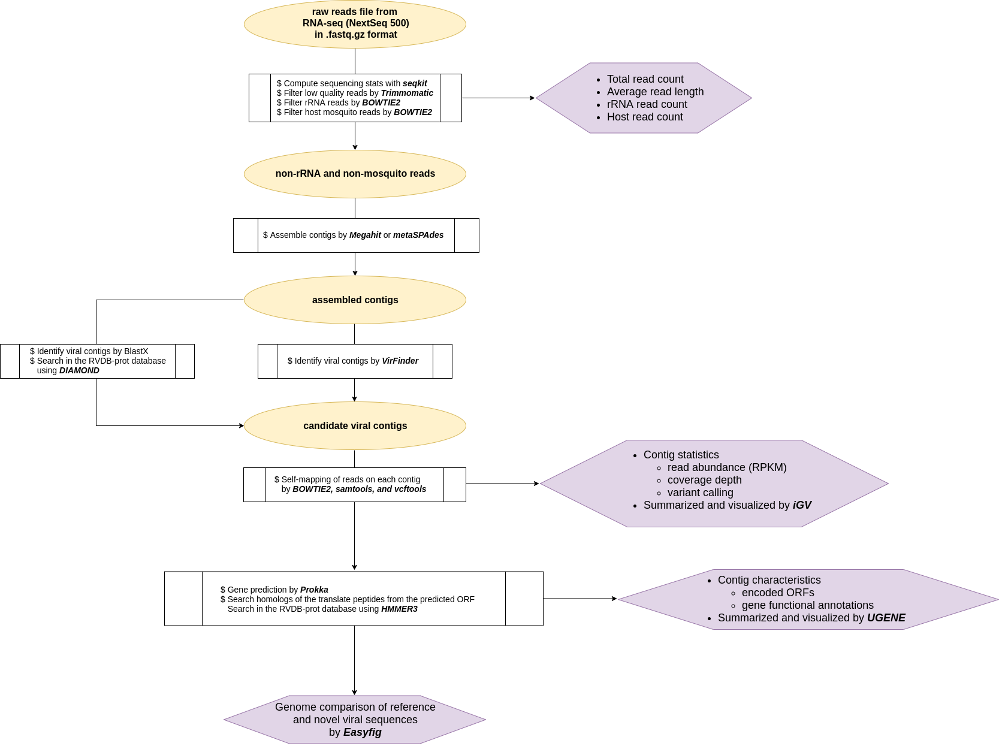

# auto_metaviromics
An automated pipeline working on metagenomics analyses of mosquito virome  
The current version: 0.2.7  

***
## Flowchart of the pipeline  
  

## Usage
**NOTE:the pipeline assumes that it works on a cluster computer managed with Slurm (currently working on only the TARS cluster in Institut Pasteur)**  
**Dependencies required by pipeline must be loaded from the Environment Modules package**  
**Otherwise you need to install them in your local environment by yourself and set your own environment (Conda with the bioconda channel can be very useful)**  
+ Dependencies
    + [SeqKit](https://github.com/shenwei356/seqkit)
    + [Trimmomatic](https://github.com/timflutre/trimmomatic)
    + [Bowtie2](http://bowtie-bio.sourceforge.net/bowtie2/index.shtml)
    + [samtools](http://www.htslib.org/doc/samtools.html)
    + [Megahit](https://github.com/voutcn/megahit)
    + [metaSPAdes](http://cab.spbu.ru/software/spades/)
    + [R](https://www.r-project.org/)
    + [VirFinder](https://github.com/jessieren/VirFinder)
    + [Prokka](https://github.com/tseemann/prokka)
    + [EMBOSS](http://www.bioinformatics.nl/emboss-explorer)
    + [vcftools](https://vcftools.github.io/index.html)
    + [HMMER3](http://hmmer.org/)  
    + [DIAMOND](https://github.com/bbuchfink/diamond)  
    
```
cd ./pipeline
gzip -d *.gz
# follow the tutorial in [NCBItax2lin](https://github.com/zyxue/ncbitax2lin) to dump the latest NCBI taxonomy list to 'lineages-YEAR-MM-DD.csv'

# to run the pipeline on the Slurm system
sbatch run_pipeline.sh
```  
The job batch file require the below options;  
  + **--CPU**=(integer)                 specify number of CPUs to be used
  + **--MEM**=(integer)                 specify total amount of MEMORY to be used (e.g. specify 16 if you want to use 16GB)
  + **--READ-TYPE**=(integer)           specify 0 for the single-end reads and 1 for the pair-end reads
  + **--SAMPLE-PATH**=(path)            specify path to the sample file to be analyzed, e.g. /path/to/sample/XXX assuming they are named as XXX_R1.fastq.gz (single-end as XXX.fastq.gz) 
  + **--MOSQ-NAME**=(string)            specify the full name of your mosquito species
  + **--DATE**=(DD-MON-YEAR)            specify the sampling date
  + **--LOCATION**=(string)             specify the sampling location
  + **--FILTERING**=(boolean)           specify yes or no to filter host & rRNA reads
  + **--HOST-DB**=(path)                specify path to BOWTIE2 database of host mosquito genomic sequences
  + **--RNA-DB**=(path)                 specify path to BOWTIE2 database of mosquito & Human rRNA sequences
  + **--ASSEMBLING**=(boolean)          specify yes or no to assemble your reads
  + **--ASSEMBLER**=(string)            specify name of the assembler to be used, "megahit" or "metaSPAdes"
  + **--ASSEMBLE-OUTPUT**=(path)        (if --ASSEMBLING=no) specify path to the output directory of previous assembling
  + **--SUM-DIAMOND**=(boolean)         specify yes or no to identify viral sequences by DIAMOND+BLASTX
  + **--DIAMOND-DB**=(path)             specify path to DIAMOND formatted database which must be assigned with NCBI taxonomy
  + **--VIRAL-CONTIG-SEARCH**=(boolen)  specify yes or no to identify viral sequences by VirFinder
  + **--VIRFINDER-MODEL**=(path)        (if --VIRAL-CONTIG-SEARCH=yes) specify path to the VirFinder model
  + **--VIRAL-CONTIG-LIST**=(path)      (if --VIRAL-CONTIG-SEARCH=no) specify path to the user defined viral contig list 
  + **--READ-MAPPING**=(boolean)        specify yes or no to map reads on possible viral contigs in the "--VIRAL-CONTIG-LIST" file
  + **--HUMMER**=(boolen)               specify yes or no to functionally annotate ORFs predicted on viral contigs
  + **--HUMMER-DB**=(path)              (if you specified --HUMMER=yes) specify path to the HUMMER formatted database
  + **--LINEAGE**=(path)                specify path to the NCBI taxonomy lineage file     

The pipeline provides some checkpoints by turning on/off the --FILTERING, --ASSEMBLING, --SUM-DIAMOND, --VIRAL-CONTIG-SEARCH, --READ-MAPPING and --HUMMER options. 
You can stop/restart the pipeline at any of them.

+ References of the pipileine: 
  + [Zakrzewski et al. 2018](https://www.nature.com/articles/s41598-018-22945-y)
  + [Belda et al. 2019](https://www.ncbi.nlm.nih.gov/pmc/articles/PMC6702732)
  + [Langille Lab - Viromics Pipeline](https://github.com/LangilleLab/microbiome_helper/wiki/Viromics-Pipeline)

## Pipeline description
### Screening low-quality, rRNA- and host-derived reads
+ Remove low-quality reads by **Trimmomatic**
+ Remove host & human rRNA reads by mapping the reads (low-quality filtered) on the reference genomic sequences using **BOWTIE2** with '--sensitive-local' option
    + The references of 5.8S, 28S, 18S, 16S, 12S rRNA sequences were built from the collection derived from GENBANK database 
+ Remove host mosquito reads by mapping the reads (low-quality and rRNA filtered) on the reference genomic sequences  
    + The reference was build from NGS scaffolds from [VectorBase](https://www.vectorbase.org/organisms/aedes-aegypti)
+ Total number of filtered reads is computed at each step of screening by [SeqKit](https://github.com/shenwei356/seqkit)
+ Read statistics of the sample are summarized in a tab-delimited format in **Read_Stats_Samples.tsv**  

### Assembling and identifying viral contigs
+ Assemble contigs from the non-low quality, non-rRNA and non-host reads using **Megahit** or **metaSPAdes**
**Procedure1 (our own)**  
+ Subject assembled contigs to the viral sequence prediction by **VirFinder**
    + VirFinder uses an user-trained model (/pipeline/*.rda) to score the possibility of each contig as a viral sequence
    + The model embedded in /pipeline was trained with CDS sequences grobally collected from RNA virus (Riboviria)  
        + All available CDS data was retrieved from Riboviria taxonomy in GENBANK, of which genome was completed.
        + Collected sequences were clustered based on their nucleotide identity (>95%) using CD-HIT
        + Clustered sequences were subjected to the model training, following the [instruction](https://github.com/jessieren/VirFinder)
        + CDS sequences of the host mosquito species (e.g, Aedes, Anopheles, and Culex) were also collected and clustered in the same way and used in the model training.
    + Possible viral contigs are screened by their lengths (> 1000bp), coverages in the assemble (> 20), and p-value scores (< 0.01)
    + **viral_contigs_list.txt** in the output /VirFinder directory shows possible viral contigs selected by this procedure.  

**Procedure2 (generally used)**  
+ Subject assembled contigs to **DIAMOND**
    + BlastX search in the [RVDB-prot](https://rvdb-prot.pasteur.fr/) database.
    + Blast hits are assigned with the NCBI taxonomy IDs and lineage information of the reference sequences.
    + Possible viral contigs were screened by their lengths (> 1000bp), coverages in the assemble (> 20), and blastx alignment length (> 300aa)  
    + **diamond.matches.RVDB.SAMPLENAME.taxid.tsv.sum.tsv** in the output /DIAMOND directory shows possible viral contigs selected by this procedure.

### Mapping reads on viral contigs
+ For each contig predicted by **VirFinder** or **DIAMOND**;
    +  Map reads to the contig itself using **BOWTIE2** with '--very-sensitive-local' option
    +  Create a consensus sequence from the mapped reads, which is assumed to be identical with the original contig (but will have some extension)  
+ Compute the mapped read count, Reads Per Kilobase Million (RPKM), coverage depth (reads per position), and call genomic variants.
+ Statistics of contigs are summarized in a tab-delimited file, **Statistics.contigs.SAMPLENAME.tsv**
+ Coverage depths and called variants are summarized and visualized for each contig using [iGV](https://software.broadinstitute.org/software/igv/)  

### ORF prediction and gene annotation
+ Viral contigs are then subjected to possible ORF prediction by [Prokka](https://github.com/tseemann/prokka)  
+ Predicted ORFs are translated into peptides and then subjected to the homolog search in the [RVDB-prot](https://rvdb-prot.pasteur.fr/) database using **HMMER**
+ The **jackhmmer** program is used, with five iterations and e-value threshold <1.0e-10, then output top 50 hits for each query ORF in a tab-delimited file, **HMMER_annotation_SAMPLENAME.top50.tsv**  
+ The result is summarized in a tab-delimited table, **DIAMOND_BlastP_ORFs.SAMPLENAME.tsv**, showing reference protein sequence and its taxonomy information for each hit.
+ The pipeline output genbank file for each viral contig with predicted ORFs, in /GENBANK output directory, which can be directly loaded and visualized by [UGENE](http://ugene.net/)  
