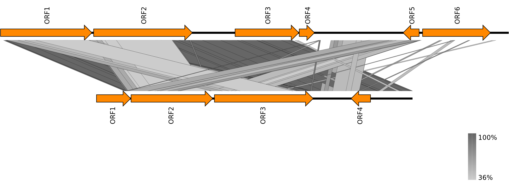

# auto_metaviromics
An automated pipeline working on metagenomics analyses of mosquito virome  
The current version: 0.2.2  
Contact: Sohta Ishikawa Ph.D (sota.ishikawa@pasteur.fr)  

***
## Flowchart of the pipeline  
  

## Usage
**NOTE:the pipeline assumes that it works on a cluster computer managed with Slurm, and dependencies required by pipeline are loaded from the Environment Modules package.**  
**Otherwise you need to install the below dependencies by yourself and set them in your PATH**  
+ Dependencies
    + [SeqKit](https://github.com/shenwei356/seqkit)
    + [Trimmomatic](https://github.com/timflutre/trimmomatic)
    + [Bowtie2](http://bowtie-bio.sourceforge.net/bowtie2/index.shtml)
    + [samtools](http://www.htslib.org/doc/samtools.html)
    + [Megahit](https://github.com/voutcn/megahit)
    + [metaSPAdes](http://cab.spbu.ru/software/spades/)
    + [R](https://www.r-project.org/)
    + [VirFinder](https://github.com/jessieren/VirFinder)
    + [GeneMark.hmm with Heuristic models](http://exon.gatech.edu/index.html)
        + Packaged in MetaGeneMark software
    + [EMBOSS](http://www.bioinformatics.nl/emboss-explorer)
    + [vcftools](https://vcftools.github.io/index.html)  
    
```
cd ./pipeline
find ./ -type f -name "*.tar.gz" -exec tar zxf {} \;
# follow the tutorial in [NCBItax2lin](https://github.com/zyxue/ncbitax2lin) to dump the latest NCBI taxonomy list to 'lineages-YEAR-MM-DD.csv'

# to run the pipeline on the Slurm management
sbatch run_pipeline.sh
```  
The job batch file require the below options;
+ Options: 
  +	**--CPU**=(integer)                 specify number of CPUs to be used
  +	**--MEM**=(integer)                 specify total amount of MEMORY to be used (e.g. specify 16 if you want to use 16GB)
  +	**--READ-TYPE**=(integer)           specify 0 if your dataset is the single-end reads and 1 for the pair-end reads
  +	**--SAMPLE-PATH**=(path)            specify path to the sample file to be analyzed, e.g. /path/to/sample/XXX if the pair-end read sequence files are named as XXX_R1.fastq.gz (single-end files should be names as XXX.fastq.gz) 
  + **--MOSQ-NAME**=(string)            specify the full name of your mosquito sampled
  + **--DATE**=(DD-MON-YEAR)            specify the sampling date
  + **--LOCATION**=(string)             specify the sampling location
  +	**--FILTERING**=(boolean)           specify yes or no if you want/don't want to filter host & rRNA reads from your raw data
  +	**--HOST-DB**=(path)                specify path to BOWTIE2 database of the host mosquito reference sequences
  +	**--RNA-DB**=(path)                 specify path to BOWTIE2 database of the mosquito & Human rRNA reference sequences
  +	**--ASSEMBLING**=(boolean)          specify yes or no if you want/don't want to assemble your sample
  + **--ASSEMBLER**=(string)            specify name of the assembler to be used, megahit or metaSPAdes
  +	**--ASSEMBLE-OUTPUT**=(path)        specify path to the output directory of previously performed assemble, if you specified --ASSEMBLING=no
  + **--VIRAL-CONTIG-SEARCH**=(boolen)  specify yes or no if you want/don't want to search possible viral contigs by VirFInder
  + **--VIRFINDER-MODEL**=(path)        specify path to the user defined VirFinder model, if you specified --VIRAL-CONTIG-SEARCH=yes
  + **--VIRAL-CONTIG-LIST**=(path)      specify path to the user defined viral contig list if you specified --VIRAL-CONTIG-SEARCH=no and want to subject your list to the read mapping
  +	**--READ-MAPPING**=(boolean)        specify yes or no if you want/don't want to map reads on your contigs
  + **--ORF-PRED**=(boolen)             specify yes or no if you want/don't want to predict ORFs on your contigs and perform their functional annotation via DIAMOND
  +	**--DIAMOND-DB**=(path)             specify path to DIAMOND formatted database which must be assigned with NCBI taxonomy, if you specified --ORF-PRED=yes
  +	**--LINEAGE**=(path)                specify path to NCBI taxonomy dump file converted in lineage format, if you specified --ORF-PRED=yes
+ The pipeline provide some checkpoints by turn on/off the --FILTERING, --ASSEMBLING, --VIRAL-CONTIG-SEARCH, --READ-MAPPING and --ORF-PRED options. You can stop and restart the pipeline at any of them.
+ References of the pipileine: 
  + [Zakrzewski et al. 2018](https://www.nature.com/articles/s41598-018-22945-y)
  + [Belda et al. 2019](https://www.ncbi.nlm.nih.gov/pmc/articles/PMC6702732)

## Procedures
### Screening low-quality, rRNA- and host-derived reads
+ Remove low-quality reads by **Trimmomatic**
+ Remove host & human rRNA reads by mapping the low-quality filtered reads on the reference using **BOWTIE2** with '--sensitive-local' option
    + The reference of 5.8S, 28S, 18S, 16S, 12S rRNA was built by collecting corresponding sequences of mosquito and human from GENBANK in a FASTA format. 
+ Remove host mosquito reads by mapping the low-quality and rRNA filtered reads on the reference
    + The reference was build from NGS scaffolds from the [VectorBase](https://www.vectorbase.org/organisms/aedes-aegypti) in a FASTA format.
+ Total number of filtered reads can be computed at each step of screening by [SeqKit](https://github.com/shenwei356/seqkit)
+ Read statistics of the sample are summarized in a tab-delimited file, **Read_Stats_Samples.tsv**  

### Assembling contigs and identifying viral contigs
+ Assemble contigs from the non-low quality and non-rRNA, non-mosquito reads set using **Megahit** or **metaSPAdes**
+ Subject assembled contigs to the viral sequence prediction by their k-mer frequency using **VirFinder**
    + VirFinder uses an user-trained model (/pipeline/VF.trainModUser.AeAegypt_Riboviria.rda) to score the possibility of each contig as a viral sequence
    + The pipeline embedded model was trained based on the CDS sequences of global taxonomy of RNA virus
        + In GENBANK, all available CDS data was retrieved from Riboviria, of which genome was completed.
        + Then the collected sequences were clustered based on their nucleotide identity (>95%) using CD-HIT
        + Clustered sequences set was subjected to the model training by VirFinder, following the [instruction](https://github.com/jessieren/VirFinder)
        + CDS sequences of host mosquito species were also collected and clustered in the same way and used in the model training.
+ Possible viral contigs were screened by their lengths (> 1000bp), coverages in the assemble (> 10), and p-value scores (< 0.01)

### Mapping reads on the possible viral contigs
+ For each contig predicted by VirFinder;
    +  Map non-low quarity and non-mosquito reads to the contig itself using **BOWTIE2** with '--sensitive-local' option
    +  Create a consensus sequence from the mapped reads, which is assumed to be identical with the original contig
+ Compute the mapped read count, viral abundance as Reads Per Kilobase Million (RPKM), coverage depth (reads per position), and call genomic variants.
+ Read statistics of contigs are summarized in a tab-delimited file, **Statistics.contigs.SAMPLENAME.tsv**
+ Coverage depths and called variants are summarized and visualized for each contig using **iGV**.  

### ORF prediction and protein gene annotation
+ Contigs from the above mapping procedure is then subjected to the gene prediction by [GeneMark.hmm](http://exon.gatech.edu/index.html). 
+ Predicted genes (ORFs) are translated into protein sequences and then subjected to BlastP search on NCBI NR database using **DIAMOND**
+ The result is summarized in a tab-delimited table, **DIAMOND_BlastP_ORFs.SAMPLENAME.tsv**, showing subject protein sequence and its taxonomy information for each hit.
+ The pipeline output genbank file for each viral contig, which can be directly loaded and visualized by [UGENE](http://ugene.net/)  

***
## Post pipeleine analyses  
### Phylogenetic placement of novel viral sequences based on marker proteins, RdRp and capsid
+ Pick novel viral sequences, which were annotated with the RNA-dependent RNA polymerase (RdRp) and capsid genes in the pipeline (ORf prediction and BlastP DIAMOND run)
+ RdRp and capsid protein sequence sets of RNA virus (Riboviria) were build and embedded in the /sample directory.
    + CDS sequences of RdRp and capsid were retrieved from all completed genomes of Riboviria available in GENBANK.
    + Sequences were then clustered by CD-HIT with the threshold of protein sequence identity >95%.
+ The global RNA viral RdRp/capsid sequence datasets, combined novel viral sequences found in the pipeline, are subjected to the phylogenetic analysis using the [Graph-Splitting method](https://github.com/MotomuMatsui/gs).
    + The method is suggested to be a robust method to reconstruct phylogenetic tree from sequence data set of highly divergent protein family, which is not capable to be aligned in a single MSA.
+ The folowing command output the phylogenetic tree with branch support value estimated by the GS method.
```
gs2 input -e 100 -l > output
```  

### Genome comparison 
+ Viral sequence found in the pipeline can be compared with its 'neighbors', i.e., some reference sequences of known virus which are annotated to the novel sequence in the Blast analysis or post phylogenetic analysis, or some other novel sequences from other samples having similar taxonomic profiles with the sequence of interest.
+ Sequence comparison based on the sequence similarity of nucleotide or protein level is performed by the pairwise comparison by BlastN or TBlastX visualized using **[Easyfig](https://mjsull.github.io/Easyfig/)** genome comparison tool.  
An example snapshot;
  

